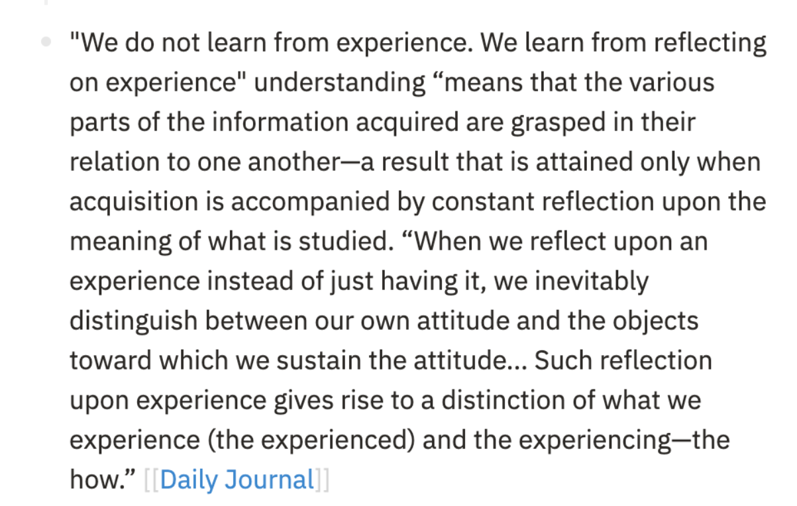

- LATER Doppler Effect {{renderer :todomaster}}
  :LOGBOOK:
  CLOCK: [2023-05-21 Sun 00:53:45]
  CLOCK: [2023-05-21 Sun 00:53:47]
  :END:
	- LATER have to watch the linux tutorial
	- DONE Take notes of the JavaScript course
	  SCHEDULED: <2023-05-17 Wed>
	  :LOGBOOK:
	  CLOCK: [2023-05-23 Tue 06:03:22]--[2023-05-23 Tue 06:03:25] =>  00:00:03
	  :END:
	- DONE researching about the logseq app
	  :LOGBOOK:
	  CLOCK: [2023-05-21 Sun 01:32:54]
	  CLOCK: [2023-05-21 Sun 01:32:59]--[2023-05-21 Sun 03:05:28] =>  01:32:29
	  :END:
-
- DONE have to add the [multiple](https://akhileshw.tech) sliders page plugin to *obsidian* ?
  id:: 646938ef-d87e-41f0-9105-38cfb4d699aa
  SCHEDULED: <2023-05-22 Mon>
-
- TODO this is red line
-
- "We do not learn from experience. We learn from reflecting on experience" understanding "means that the various parts of the information acquired are grasped in their relation to one another-a result that is attained only when acquisition is accompanied by constant reflection upon the meaning of what is studied. "When we reflect upon an experience instead of just having it, we inevitably distinguish between our own attitude and the objects toward which we sustain the attitude... Such reflection upon experience gives rise to a distinction of what we experience (the experienced) and the experiencing-the how." [[Daily Journal]]
-
- 
-
-
- 22:36 Gonna read all about logseq till 12 AM
-
-