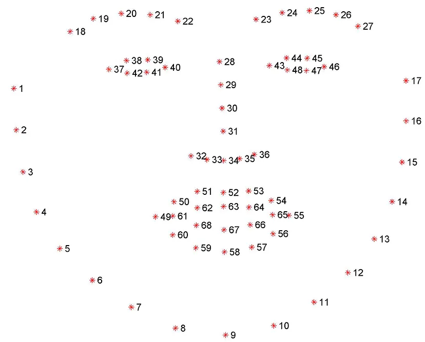

-
-
- The first step is to download the required packages. Installation via pip:
- ```python
  pip install opencv-python
  pip install dlib
  ```
-
- Other than this we will need a facial keypoints detector that can detect eyes in real-time. For this will use a pre-trained network in the dlib library which can detect ’68 key points’ that was presented in this [paper](https://www.semanticscholar.org/paper/One-millisecond-face-alignment-with-an-ensemble-of-Kazemi-Sullivan/d78b6a5b0dcaa81b1faea5fb0000045a62513567). The required pre-trained model can be downloaded from [here](https://github.com/davisking/dlib-models/blob/master/shape_predictor_68_face_landmarks.dat.bz2). Dlib is used because it can give predictions in real-time, unlike a CNN model which was very important for me as I was making an AI for online proctoring.
-
- 
-
-
- libraries
	- opencv
	- dlib
	- pyautogui
	-